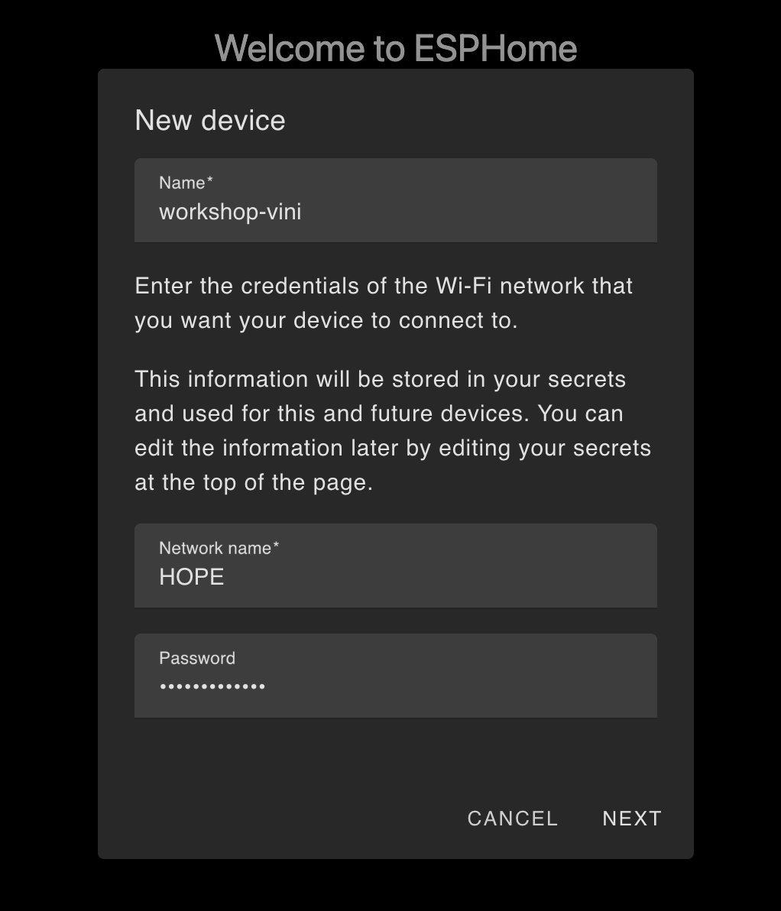

# Step 1: Create Your First Firmware

1. In the home screen, press **NEW DEVICE** on the bottom right.
1. In the *New device* dialog:

    1. Name your device `workshop`. We'll tweak it later to avoid collision with others.
    1. Enter the wifi credentials:
        - Name: `Workshop AP`
        - Password: `hope2025`
    1. Press **NEXT**.

    

1. In the *Installation* dialog, press **SKIP THIS STEP**.

1. In the *Select your device type* dialog, select **ESP32-C3**. This will add a configuration entry on your dashboard.

1. In the *Configuration created* dialog, press **SKIP**. This will take you back to the dshboard, now with a config entry in it

    


1. On the newly created config, press **EDIT**.

1. We will make some edits to make the same code work for everyone.
    1. At the top, add a section for substitutions:
    ```yaml
    substitutions:
      # This depends on how your device is wired.
      PIN_LED: GPIO08
      PIN_BUTTON: GPIO09
      # Insert your own keys here.
      API_KEY: "COPY_FROM_GENERATED_CODE"
      OTA_KEY: "COPY_FROM_GENERATED_CODE"
      # Unique name for your device
      unique_name: workshop-${OTA_KEY[-6:]}
    ```
    1. Now replace the the rest of the code with the code in [code.yaml](code.yaml).

1. Press **INSTALL** (this will save the file for you).

1. In the *How do you want to install* dialog, select the third option: **Plug into the computer running ESPHome Device Builder**.

1. In the *Pick Server Port* dialog, select **USB JTAG/serial debug unit**. this will start the firmware build and install it on your device.
  - If the device doesn't show up, your USB cable may be power-only (no data).
  - People have had issues with permissions on Linux. Your user may have
    to be in the right group to see the serial devices:

    ```sh
    sudo usermod -a -G dialout $USER
    ```
    Otherwise a possible workaround
    may be running the dashboard with `sudo`.

This will generate the firmware, flash the device, start it and stream the logs. This may take a some time the first, so you can [slack off](https://xkcd.com/303/) for a bit.

> **Note:** At this point, let's understand the logs and see how to add the device to Home Assistant.

## Web Server

1. Comment out the wifi credentials:

    ```yaml
    # Wifi credentials.
    #ssid: !secret wifi_ssid
    #password: !secret wifi_password
    ```

1. Reinstall the firmware

1. Your device will start an access point

1. Go to your device's address (`${unique-name}.local`).

1. Control your device.

## Wifi provisioning with Captive Portal

1. Uncomment the `captive_portal` component:

    ```yaml
    # Triggers a captive portal for wifi configuration if configured wifi fails.
    captive_portal:
    ```

1. Reconnect to the internet (HOPE16) and reinstall the firmware.

1. Connect to the device access point as before.

1. Go to your device's web server (`${unique-name}.local`).

1. Configure the wifi using the captive portal

## OTA

> Note: This won't work on the HOPE16 wifi.

1. Press **EDIT** on the device card.

1. Change the log line from `esphome.on_boot` to `Hello OTA`, like this:

    ```yaml
    esphome:
    name: ${unique_name}
    friendly_name: Workshop Demo
    on_boot: 
      then:
        - logger.log: Hello OTA!
    ```

1. Press **INSTALL**

1. This time, in the *How do you want to install* dialog, select "Wirelessly".
    - This will install the firmware over the air. No need for the serial connection (but keep it plugged, you still need to power the device).
    - You must be on the same local network as the device.

    


## Local Automation

1. Uncomment the event handles on the `boot_button`:

    ```yaml
    binary_sensor:
      - id: boot_button
        name: Boot Button
        platform: gpio
        pin:
          number: ${PIN_BUTTON}
          inverted: True
        on_click: 
          - light.toggle: led
        on_double_click: 
          - light.turn_on:
              id: led
              effect: Flicker
    ```

  1. Reinstall the firmware

  1. Try the buttons

<!-- <div align=right><p>

➡️ Go to [Step 2](../step-2/INSTRUCTIONS.md)

</p></div> -->