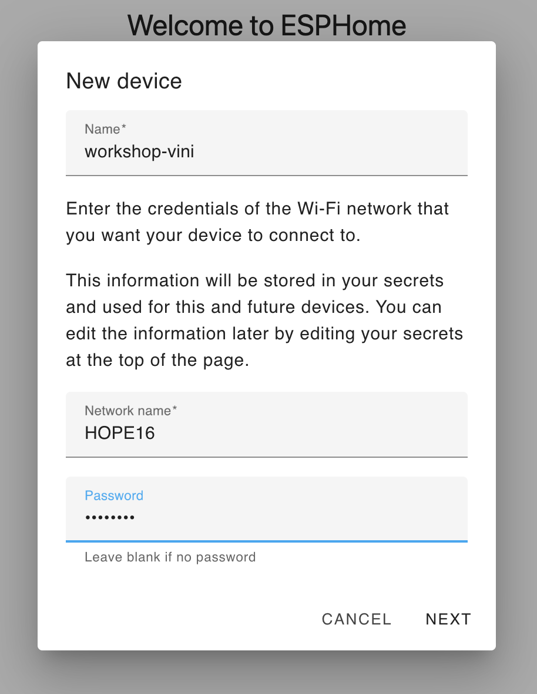
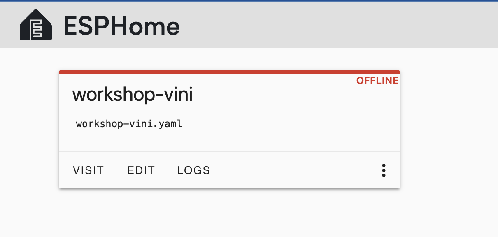

# Step 1: Create your first firmware

1. In the home screen, press **NEW DEVICE** on the bottom right.
1. In the *New device* dialog:

    1. Name your device `workshop-<unique>`, where the `<unique>` suffix should be something unique
    to your device to avoid collision with others.
    1. Enter the wifi credentials:
        - Name: `HOPE16`
        - Password: `hope2025`
    1. Press **NEXT**.

    

1. In the *Installation* dialog, press **SKIP THIS STEP**.

1. In the *Select your device type* dialog, select **ESP32-C3**. This will add a configuration entry on your dashboard.

1. In the *Configuration created* dialog, press **SKIP**. This will take you back to the dshboard, now with a config entry in it

    


1. On the newly created config, press **EDIT**.

1. Append the following to the generated code:

    ```yaml
    ## Generated code above ##

    binary_sensor:
      - id: boot_button
        name: Boot Button
        platform: gpio
        pin:
          number: GPIO09
          inverted: True

    light:
      - id: led
        name: Board LED
        platform: monochromatic
        output: led_output
        effects:
          - pulse:
          - flicker:
          - strobe:

    output:
      - id: led_output
        platform: ledc
        pin:
          number: GPIO08
          inverted: True
    ```

    > **Note:** At this point, let's pause and understand the components we have configured.

1. Press **INSTALL** (this will save the file for you).

1. In the *How do you want to install* dialog, select the third option: **Plug into the computer running ESPHome Device Builder**.

1. In the *Pick Server Port* dialog, select **USB JTAG/serial debug unit**. this will start the firmware build and install it on your device.
  - If the device doesn't show up, your USB cable may be power-only (no data).
  - People have had issues with permissions on Linux. Your user may have
    to be in the right group to see the serial devices. A possible workaround
    may be running the dashboard with `sudo`.

This will generate the firmware, flash the device, start it and stream the logs.

> **Note:** At this point, let's understand the logs and see how to add the device to Home Assistant.

<div align=right><p>

➡️ Go to [Step 2](step-2/INSTRUCTIONS.md)

</p></div>